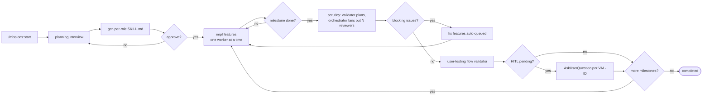

# missions

Long-running, validator-gated, fix-loop-driven multi-feature missions for Claude Code.
A reverse-engineered, plugin-native rebuild of Factory.ai droid's `/missions`, grounded
in a complete empirical study of a real 3-milestone Factory mission (29 features, 28
handoffs, 119 progress events, 18 reviews — every schema here round-trips against those
artifacts).

## Install

```bash
claude plugin marketplace add <this-repo>
claude plugin install missions@dotclaude
```

Then add to your project's (or user) `.claude/settings.json`:

```json
{ "agent": "missions:missions-orchestrator" }
```

Optionally git-ignore mission state: add `.claude/missions/` to `.gitignore`.

## Usage

| Command | What it does |
|---|---|
| `/missions:start "<objective>"` | Mint a mission, run the planning interview, generate per-role skills, get approval, run |
| `/missions:status [id]` | Compact disk-truth snapshot |
| `/missions:list` | All missions in this project |
| `/missions:kill [id]` | Pause (orchestrator refuses to advance) |
| `/missions:resume <id>` | Re-activate and continue from disk |

All mission state lives in `./.claude/missions/<uuid>/` — per project, never under `~`.

## Architecture

### Mission lifecycle



### Why the shape is what it is

- **Subagents can't spawn subagents**, so validators only *plan* fan-outs; the
  orchestrator issues the parallel `Agent(...)` calls.
- **`SubagentStop` hooks can't inject context into the parent** (verified empirically),
  so all post-worker bookkeeping is hook-side and disk-only; the orchestrator reads
  `hints/orchestrator-hint.txt` at the top of every turn. Hints are advisory.
- **The same SubagentStop fires ~10× per stop**, so every hook short-circuits on
  `stop_hook_active`.
- **Disk is the source of truth.** State is checkpointed *before* every spawn; every
  decision turn rereads `state.json`/`features.json`; compaction and token-death are
  recoverable by construction (`SessionStart` resume/compact hooks inject a recovery
  snapshot).
- **All shared-state mutations are locked** (`bin/update-*.sh`, mkdir-spinlock — macOS
  has no flock) and schema-validated post-write; raw `Edit` of control-plane files is
  forbidden and caught by PostToolUse hooks (exit 2 feeds the error back to the writer).
- **Every handoff item gets a disposition**: extracted to a `fix-*` feature
  (`bin/insert-fix-feature.sh` — fix features can be created from scrutiny *or* directly
  from a handoff that reveals a gap) or dismissed with a logged justification
  (`bin/dismiss-handoff-items.sh`).
- **Knowledge pipeline**: reviewers record `sharedStateObservations` (knowledge /
  conventions / skills); only the orchestrator merges them into `library/*.md` at
  synthesis — reviewers run in parallel and never touch shared docs.

### Control plane (per mission)

```
.claude/missions/<uuid>/
├── mission.md  architecture.md  validation-contract.md      # planner-written
├── features.json  state.json  validation-state.json         # locked mutations only
├── progress_log.jsonl                                       # append-only typed events
├── skills/<role>/SKILL.md                                   # generated per worker role
├── planning/interview.jsonl                                 # durable interview answers
├── handoffs/<ts>__<feature>__<session>.json                 # hook-validated
├── hints/orchestrator-hint.txt                              # the hook→orchestrator channel
├── library/<topic>.md                                       # curated tribal knowledge
├── evidence/<milestone>/<feature>/                          # captured stdout/stderr
└── validation/<milestone>/{scrutiny,user-testing}/          # plans, reviews, syntheses
```

## Agents

| Agent | Model | Role |
|---|---|---|
| `missions-orchestrator` | opus | state machine; the only one that spawns and the only writer of library/ |
| `missions-impl-worker` | sonnet | one feature per spawn; commits; writes a schema-validated handoff |
| `missions-scrutiny-validator` | sonnet | runs test/typecheck/lint; plans the review fan-out |
| `missions-scrutiny-feature-reviewer` | sonnet | reviews one feature; N run in parallel |
| `missions-flow-validator` | sonnet | user-level validation per surface; flags HITL deferrals |

## Tests

- `tests/roundtrip-factory-artifacts.sh` — every schema vs the real Factory mission
  artifacts (63 checks).
- `tests/e2e/fizzbuzz-mission.sh` — full headless mission with a seeded bug that must be
  caught by scrutiny and fixed via the fix loop (manual run; spawns a real session).

Phase 0 mechanics-spike results (what was empirically proven about hooks/agents before
this design was committed) are in `../probe/RESULTS.md`.
